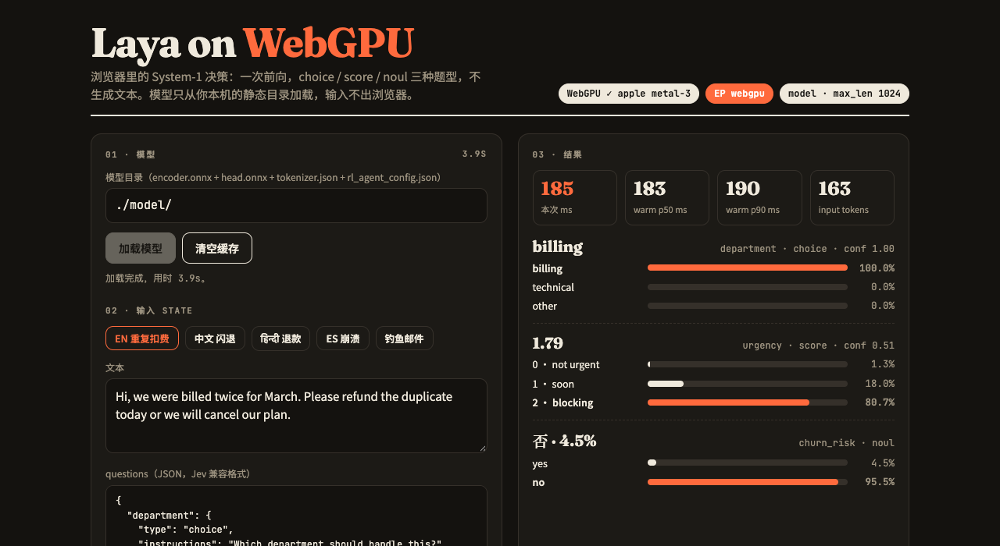

# laya-skill: System One typed decisions for Claude Code

A Claude Code skill (and plugin) for **typed-decision models**: a state (text / JSON) plus
`choice` / `score` / `noul` questions go in, and calibrated probabilities come out in one forward pass,
with no text generation.

- **Laya** ([NandhaKishorM/laya](https://github.com/NandhaKishorM/laya), Apache-2.0): run locally on
  CPU / MPS / CUDA, **in the browser on WebGPU**, or as a Jev-compatible HTTP server.
- **TypeSafe Jev** ([docs.typesafe.ai](https://docs.typesafe.ai)): the hosted, closed-weights API
  with the same wire format. The skill swaps between the two by changing a base URL.
- **Fine-tune Laya** on your own labels (RLCD), calibrate, evaluate base vs tuned, export to ONNX, and
  push to the Hub.

Code only: **no model weights** are in this repo. Checkpoints download from Hugging Face at run time.

## Install

Install per repository (project scope), not globally. Run these from the root of the repo that
should get the skill:

```bash
# as a plugin: declared in <repo>/.claude/settings.json (commit it to share with the team)
claude plugin marketplace add StevenLi-phoenix/laya-skill --scope project
claude plugin install system-one@laya-skill --scope project

# or as a plain skill, copied into <repo>/.claude/skills/
git clone --depth 1 https://github.com/StevenLi-phoenix/laya-skill /tmp/laya-skill
mkdir -p .claude/skills && cp -R /tmp/laya-skill/skills/system-one .claude/skills/
```

Both commands default to `--scope user` (global), so pass `--scope project` explicitly. Use
`--scope local` to keep the declaration in the git-ignored `.claude/settings.local.json`. With
project scope, `~/.claude/settings.json` stays untouched. Claude Code still keeps its plugin
cache and install registry under `~/.claude/plugins/`, as it does for every plugin. To remove:
`claude plugin uninstall system-one@laya-skill --scope project`.

Requires [uv](https://docs.astral.sh/uv/). Every script is a PEP 723 `uv run` script that pins
`laya==0.3.22`. For the browser sample you need Chrome with WebGPU.

## Use

Ask Claude things like *"triage these tickets with Laya"*, *"compare Laya and Jev on my labelled
set"*, *"fine-tune laya on data.jsonl"*, or *"run laya in the browser with WebGPU"*. Or call the scripts
directly (`S=skills/system-one/scripts`):

```bash
uv run $S/laya_predict.py --state "Billed twice, refund or we cancel" --questions skills/system-one/assets/examples/questions.json
TYPESAFE_API_KEY=... uv run $S/jev_predict.py --state "..." --questions q.json
$S/serve.sh & uv run $S/jev_predict.py --base-url http://127.0.0.1:8000 --state "..." --questions q.json
uv run $S/compare.py data.jsonl --backend laya:english --backend laya:multilingual --backend jev
uv run $S/finetune_laya.py --data train.jsonl --base english --out runs/ft
uv run $S/export_onnx.py --model runs/ft/checkpoint --target browser --out-dir ./webgpu/model
```

Docs for Claude (and you): [`SKILL.md`](skills/system-one/SKILL.md) (decision tree + commands) and
[`references/`](skills/system-one/references/) ([Laya API](skills/system-one/references/laya-api.md),
[Jev API](skills/system-one/references/jev-api.md),
[model selection](skills/system-one/references/model-selection.md),
[fine-tuning](skills/system-one/references/finetune.md),
[serving](skills/system-one/references/serving.md),
[WebGPU](skills/system-one/references/webgpu.md)).

## Layout

```
.claude-plugin/            plugin.json, marketplace.json
skills/system-one/
  SKILL.md                 when to use, Jev vs Laya decision tree, commands
  references/              detailed docs, read on demand
  scripts/                 laya_predict, jev_predict, compare, finetune_laya, export_onnx, serve.sh
    systemone.py           shared schema validation + metrics (stdlib only)
    vendor/                upstream ONNX exporters (Apache-2.0, unmodified)
  assets/examples/         tickets.jsonl (40 labelled, EN/中文/ES), questions.json, quickstart.py
  assets/webgpu/           browser sample + headless-Chrome verifier
tests/                     pytest (unit + mocked Jev HTTP + LAYA_INTEGRATION=1 weight tests)
```

## Measured (2026-09-29)

**WebGPU sample** (`laya-multilingual`, fp32 split ONNX, headless Chrome, 3 questions, 163 tokens, 20 warm runs):

| machine | load | WebGPU p50 / p90 | forced WASM p50 / p90 | speed-up |
|---|---|---|---|---|
| MacBook Pro M4 Pro | 7.3 s | 148 / 156 ms | 808 / 846 ms | 5.5× |
| Mac mini M4 16 GB | 3.9 s | 183 / 190 ms | 810 / 819 ms | 4.4× |

The answers were identical on both providers and both machines.

**Laya checkpoints, zero-shot, on the bundled 40-ticket example set** (Mac mini M4, MPS, `compare.py`):

| backend | accuracy | choice | noul | score (level) | ECE | p50 |
|---|---|---|---|---|---|---|
| `laya:auto` (router) | 0.658 | 0.800 | 0.775 | 0.400 | 0.175 | 82 ms |
| `laya:english` | 0.600 | 0.775 | 0.600 | 0.425 | 0.097 | 92 ms |
| `laya:multilingual` | 0.642 | 0.800 | 0.775 | 0.350 | 0.304 | 36 ms |

The English and multilingual checkpoints agree on only 57.5% of decisions. The probabilities are not
interchangeable, so re-pick thresholds whenever you switch.

**Other checks on the Mac mini:**
- `finetune_laya.py --smoke` takes 14 s end to end.
- A full-encoder English fine-tune (33 updates) takes 70 s on 16 GB.
- The fine-tuned checkpoint reloads, predicts, and exports to browser ONNX (torch vs ONNX ≤ 3e-6).
- CPU flat + INT8 export scores through `laya-evals run --onnx` at 61 ms p50.
- The Jev client against `laya-serve` agrees 100% with in-process Laya.

## Verified vs not

- Jev endpoint, auth, schema, models, limits, pricing ($0.042 / M input tokens, output free) and SDK
  names are from TypeSafe's docs as of 2026-09-29.
- **No Jev key was used.** The Jev client is tested against a local mock and against `laya-serve`.
- Jev benchmark numbers (0.727 on typed-decisions, and others) come from the Laya README and third
  parties, not from TypeSafe. See [jev-api.md](skills/system-one/references/jev-api.md#unverified--third-party).

## Tests

```bash
uv venv --python 3.12 && uv pip install laya==0.3.22 pytest
.venv/bin/python -m pytest -q                        # unit + mocked HTTP, no weights
LAYA_INTEGRATION=1 .venv/bin/python -m pytest -q     # + real inference and fine-tune smoke
uv run skills/system-one/assets/webgpu/verify_webgpu.py [--force-wasm]   # after exporting model/
```

## License

Apache-2.0 (see [LICENSE](LICENSE) and [NOTICE](NOTICE)). The project builds on Laya by Convai
Innovations. It is not affiliated with TypeSafe AI or Convai Innovations.
